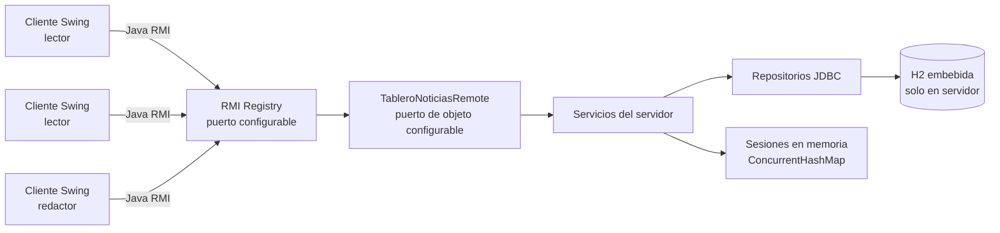

# Tablero distribuido de noticias con Java RMI

Proyecto académico multimódulo que demuestra comunicación remota entre una aplicación servidor y varios clientes de escritorio. El servidor publica un contrato Java RMI, concentra las reglas de negocio y conserva la información en H2; los clientes Swing actúan como lectores anónimos o redactores autenticados sin acceder directamente a la base de datos.

El diseño privilegia una implementación pequeña y legible. No utiliza servidor HTTP, REST, frameworks web, contenedores ni ORM: el objetivo es observar con claridad el límite remoto, la serialización, la concurrencia de solicitudes y los fallos propios de un sistema distribuido.

## Arquitectura

El RMI Registry permite localizar el servicio `TableroNoticias`. El stub expone únicamente modelos serializables y excepciones de dominio definidos en `common`. Cada operación remota vuelve a validar los datos y las operaciones de escritura se resuelven en el servidor mediante JDBC y transacciones.

## Tecnologías

- Java 17.
- Maven y estructura multimódulo.
- Java RMI como transporte distribuido.
- Swing para la interfaz gráfica.
- H2 embebida persistente y JDBC.
- BCrypt para hashes de contraseñas.
- SLF4J y Logback para registros del servidor.
- JUnit 5 para pruebas unitarias, de integración y concurrencia.

## Módulos Maven

| Módulo | Responsabilidad |
|---|---|
| `common` | Contrato remoto, modelos serializables, DTO, excepciones y validaciones compartidas. No contiene JDBC ni secretos. |
| `server` | Configuración, H2, datos iniciales, repositorios, servicios, sesiones, objeto remoto y arranque del Registry. |
| `client` | Conexión configurable, interfaz Swing, tabla, filtros, autenticación y CRUD asíncrono. |

Los artefactos finales previstos son `tablero-noticias-server.jar` y `tablero-noticias-client.jar`. El primero incluye H2, BCrypt y logging; ambos incluyen las clases necesarias de `common` mediante el empaquetado configurado con Maven Shade.

## Componentes del sistema

`TableroNoticiasRemote` define verificación de estado, autenticación, cierre de sesión, listado, búsqueda, filtro, consulta individual, publicación, edición y eliminación. Sus excepciones distinguen autenticación, autorización, validación, ausencia de una noticia, conflicto de edición y falta de disponibilidad del servicio.

El servidor separa la frontera RMI de la lógica de autenticación y noticias. `DatabaseManager` entrega una conexión por operación, `DatabaseInitializer` crea el esquema y los datos de demostración de forma idempotente, y los repositorios utilizan consultas preparadas. La configuración real contempla `rmi.host`, `rmi.port`, `rmi.object.port`, `rmi.service`, `database.path` y `session.timeout.minutes`.

El cliente empieza con `ConexionDialog`, que conserva host, puerto y nombre de servicio si falla un intento. `ConexionRmi` localiza el Registry y verifica el estado remoto. Las pantallas de conexión y las operaciones remotas usan `SwingWorker`, de modo que una espera de red no bloquea el Event Dispatch Thread.

## Roles y funcionalidades

El lector es anónimo: puede listar, buscar, filtrar, abrir y actualizar noticias sin crear una sesión. Esta decisión elimina cuentas innecesarias para operaciones públicas y mantiene una separación clara: ningún método de escritura funciona sin un token de redactor válido.

El redactor inicia sesión con usuario y contraseña, consulta las mismas noticias y puede publicar. Solo puede editar o eliminar noticias cuyo `autor_id` coincida con su sesión. Esta autorización se comprueba en el servidor; ocultar o deshabilitar botones en Swing mejora la experiencia, pero no constituye una barrera de seguridad.

Las noticias contienen identificador, título, contenido, categoría, autor, fechas de creación y modificación y versión. Las categorías disponibles son Tecnología, Ciencia, Educación, Deportes, Cultura, Economía y General. Los listados se ordenan de manera estable por modificación descendente y, ante empate, por identificador.

## Comunicación mediante RMI

Servidor y cliente comparten exactamente la interfaz y los tipos de `common`. RMI serializa los argumentos y valores de retorno por valor; no se transmiten conexiones JDBC, entidades internas ni hashes. Las excepciones de dominio declaradas cruzan la frontera remota como tipos conocidos por ambos procesos, mientras que `RemoteException` representa fallos de transporte, Registry, conexión o ejecución remota.

El servidor configura `java.rmi.server.hostname`, crea o reutiliza el Registry y exporta el objeto en un puerto configurable. Separar el puerto del Registry del puerto del objeto facilita abrir reglas concretas de firewall cuando las aplicaciones se ejecutan en equipos diferentes.

## Persistencia

H2 se ejecuta en modo embebido y persistente en el equipo servidor. El esquema contiene `autores`, `noticias` y una pequeña tabla `schema_metadata` para controlar la aplicación idempotente de datos iniciales. Las claves foráneas, restricciones `NOT NULL`, unicidad de usuario y comprobación de versión complementan la validación de Java.

Todas las entradas variables se envían mediante `PreparedStatement`. Publicar, editar y eliminar utilizan transacciones explícitas; un error provoca `rollback`. La base es la única fuente permanente de noticias y los clientes solo mantienen la vista necesaria para mostrar el último resultado remoto.

## Concurrencia y consistencia

RMI puede despachar invocaciones simultáneas en distintos hilos. Los servicios no guardan datos mutables de una petición en atributos y cada operación JDBC obtiene su propia conexión. Las sesiones se almacenan en una estructura concurrente y su vigencia se verifica al utilizar un token.

La edición usa control optimista: el cliente envía la versión que abrió y el `UPDATE` incluye esa versión en el `WHERE`. Si otro cliente modificó antes la noticia, cero filas son actualizadas y se lanza `ConflictoEdicionException`. El segundo cambio nunca sobrescribe silenciosamente al primero. Las transacciones, restricciones SQL, autorización por propietario y orden estable completan la estrategia de consistencia.

## Tolerancia a fallos

La interfaz trata una dirección incorrecta, puerto inaccesible, Registry ausente, servicio no registrado, desconexión durante una operación, sesión expirada, datos inválidos y conflictos de edición. Una `RemoteException` no cierra la ventana; se presenta un mensaje breve y se permite volver a abrir el diálogo de conexión.

El servidor registra los fallos relevantes sin contraseñas, hashes, tokens completos ni contenido innecesario. Los recursos JDBC se cierran con `try-with-resources`, los fallos de escritura revierten la transacción y los detalles internos de SQL no se devuelven al cliente. Un shutdown hook cierra H2 de forma ordenada.

Esta tolerancia no equivale a alta disponibilidad: existe un único servidor y una única base local. Si el servidor está detenido no hay réplica que continúe atendiendo solicitudes.

## Seguridad básica

Las contraseñas de demostración se transforman con BCrypt antes de almacenarse. Los tokens se generan aleatoriamente, se conservan solo en memoria y expiran. La autorización y validación definitivas viven en el servidor. El cliente limpia los arreglos `char[]` de contraseña cuando deja de necesitarlos y nunca recibe hashes.

RMI, tal como se utiliza en esta práctica, no está protegido con TLS. Es apropiado para una demostración en una red local controlada, pero no para una red pública hostil. Un entorno real exigiría cifrado del transporte, identidad de servidor, gestión segura de secretos y políticas de autenticación más robustas.

## Pruebas

La estrategia incluye validaciones y serialización en `common`, autenticación y sesiones, autorización, repositorios con H2 independiente, control optimista, integración contra un Registry real y escenarios con `ExecutorService` para lectores y escritores simultáneos.

Estado al redactar este documento:

| Verificación | Estado |
|---|---|
| Pruebas aisladas de `common` | 11 ejecutadas correctamente |
| Pruebas unitarias y de servidor | 22 pruebas totales aprobadas, sin fallos ni omisiones |
| Integración RMI | Aprobada contra un Registry real en puerto de prueba |
| Concurrencia | Aprobadas lecturas, publicaciones, edición optimista y lectura/escritura simultáneas |
| `mvn clean test` del reactor | `BUILD SUCCESS` (22 pruebas) |
| `mvn clean package` y JAR ejecutables | `BUILD SUCCESS`; JAR de servidor y cliente verificados |
| Pruebas manuales en varios equipos | Pendiente |

Las pruebas manuales entre varios equipos permanecen pendientes porque requieren infraestructura física externa. Los casos se detallan en [docs/PRUEBAS_MANUALES.md](docs/PRUEBAS_MANUALES.md).

## Credenciales académicas de demostración

| Usuario | Contraseña | Nombre visible |
|---|---|---|
| `redactor1` | `redactor123` | Ana Torres |
| `redactor2` | `noticias123` | Luis Mendoza |

Estas credenciales son públicas e intencionalmente sencillas; solo deben usarse con los datos de demostración. H2 conserva únicamente sus hashes BCrypt.

## Limitaciones

- Un solo servidor y una sola base H2: no existe replicación ni conmutación automática.
- Las sesiones se pierden al reiniciar el servidor.
- No hay callbacks RMI; los lectores actualizan manualmente.
- La búsqueda con `LIKE` es adecuada para el volumen académico, no para grandes colecciones.
- RMI sin TLS limita el sistema a redes controladas.
- No hay recuperación automática de una operación de escritura cuya respuesta se perdió; reintentar una publicación podría requerir comprobación del usuario.
- La configuración de firewall y direccionamiento depende de la red donde se despliegue.

## Documentación adicional

- [Arquitectura](docs/ARQUITECTURA.md)
- [Modelo de datos](docs/MODELO_DATOS.md)
- [Concurrencia y consistencia](docs/CONCURRENCIA_Y_CONSISTENCIA.md)
- [Tolerancia a fallos](docs/TOLERANCIA_A_FALLOS.md)
- [Pruebas manuales](docs/PRUEBAS_MANUALES.md)
- [Decisiones técnicas](docs/DECISIONES_TECNICAS.md)

## Respuestas a las preguntas de reflexión

### 1. ¿Qué ventajas ofrece RMI sobre sockets tradicionales?

RMI permite que el código cliente invoque métodos definidos en una interfaz Java aunque el objeto se encuentre en otro proceso o equipo. El programador trabaja con operaciones como `listarNoticias()` o `editarNoticia(...)`, en vez de diseñar manualmente un formato de mensajes, delimitadores, códigos de operación y reglas para leer bytes parciales desde un socket.

El stub y el runtime abstraen el intercambio de mensajes. RMI serializa argumentos, resultados y excepciones; el Registry ofrece un mecanismo de localización; y `RemoteException` hace visible que una llamada que parece ordinaria puede fallar por la red. Las interfaces remotas también constituyen un contrato verificable por el compilador: cliente y servidor conocen las firmas y los tipos compartidos.

Con sockets tradicionales existe mayor libertad sobre el protocolo, la representación binaria, el uso de memoria, las conexiones y la compatibilidad entre lenguajes. Esa libertad es valiosa para protocolos especializados o de alto rendimiento, pero obliga a implementar framing, serialización, despacho, correlación de respuestas, evolución del protocolo y manejo de errores. RMI reduce ese trabajo para un sistema Java a Java y hace la práctica más cercana al dominio.

La abstracción no elimina la naturaleza distribuida: una invocación puede tardar, fallar después de haber ejecutado parcialmente una acción o devolver una excepción. Además, RMI acopla ambos extremos a Java y a clases compatibles, su interoperabilidad es menor, la configuración de puertos/firewall requiere atención y la serialización debe tratarse como una frontera sensible. Por ello RMI es más productivo que sockets para este ejercicio homogéneo, pero no siempre es el transporte preferido para sistemas abiertos o políglotas.

### 2. ¿Cómo se manejaron múltiples peticiones simultáneas?

El runtime de RMI puede atender distintas invocaciones concurrentemente. La implementación no supone que los métodos se ejecuten uno tras otro ni sincroniza globalmente el objeto remoto. En su lugar, las clases de servicio y repositorio son esencialmente sin estado: los parámetros y variables de cada petición permanecen locales al hilo que la atiende.

Cada operación obtiene una conexión JDBC propia, y cada escritura delimita su transacción. De esa manera una solicitud no comparte un `Connection`, `PreparedStatement` o `ResultSet` mutable con otra. H2 coordina el acceso a sus datos y las transacciones evitan estados parciales. Las lecturas se mantienen independientes y no esperan un monitor global de Java.

Las sesiones sí son estado compartido, por lo que se almacenan en un `ConcurrentHashMap`. La creación, consulta, expiración y eliminación de tokens se realizan con operaciones seguras de esa colección. Las noticias no se duplican en un mapa del servidor: H2 continúa siendo su única fuente de verdad.

Las pruebas de concurrencia previstas usan `ExecutorService`, `CountDownLatch` y futuros para iniciar lectores, publicaciones y ediciones con suficiente simultaneidad. En particular, dos tareas que editan la misma versión deben producir exactamente un éxito y un conflicto, sin depender de pausas arbitrarias con `Thread.sleep`.

### 3. ¿Qué problemas enfrentaron al implementar consistencia de los datos?

El caso principal es la actualización perdida. Dos redactores pueden abrir la misma noticia, conservar la misma versión y enviar cambios distintos. Si el servidor ejecutara un `UPDATE` solo por identificador, el último reemplazaría al primero sin saber que trabajó sobre información obsoleta. El campo `version` y una condición adicional en el `WHERE` convierten esa carrera en un conflicto explícito.

También se deben coordinar lecturas mientras existen escrituras. Las transacciones hacen que una publicación o edición sea una unidad: no se expone una noticia con solo parte de sus campos modificados. El orden por fecha de modificación e identificador produce resultados repetibles incluso cuando dos filas comparten una marca temporal.

La consistencia no se limita a concurrencia. El servidor debe comprobar que el autor de la sesión sea propietario de la noticia, pues confiar en un botón deshabilitado permitiría modificar datos mediante otro cliente. Las claves foráneas impiden autores inexistentes; `NOT NULL`, usuario único y `CHECK (version >= 1)` refuerzan invariantes; la validación limita textos y rechaza entradas vacías; y las consultas preparadas separan datos de SQL.

Finalmente, una excepción a mitad de una escritura debe provocar rollback. La dificultad está en traducir el fallo a una excepción de dominio comprensible sin ocultarlo en logs ni filtrar detalles internos. La solución separa el registro técnico del mensaje remoto y utiliza `try-with-resources` para liberar recursos aun cuando la operación falla.

### 4. ¿Cómo escalarías este sistema en un entorno real?

Primero separaría la lógica de negocio del transporte para conservarla al reemplazar RMI por gRPC o una API REST según los consumidores, requisitos de interoperabilidad y operación. Para clientes internos fuertemente tipados, gRPC permitiría contratos eficientes y multiplataforma; para integración web y ecosistemas amplios, HTTP/REST podría ser más accesible. La elección no sería automática: dependería de latencia, streaming, compatibilidad y herramientas disponibles.

H2 se sustituiría por una base administrada con pool de conexiones, migraciones, respaldos, réplicas y estrategia de recuperación. Varias instancias del servicio se colocarían detrás de un balanceador. Las sesiones dejarían de residir en un único proceso: podrían usarse tokens verificables de corta duración o un almacén compartido y altamente disponible. Las escrituras requerirían claves de idempotencia para soportar reintentos ambiguos.

Para cargas de lectura elevadas podrían incorporarse cachés con invalidación explícita y réplicas de lectura. La publicación de eventos mediante mensajería desacoplaría indexación, auditoría y notificaciones. Un motor de búsqueda atendería consultas de texto completo, y WebSocket, Server-Sent Events o streaming proporcionarían notificaciones en tiempo real.

La operación necesitaría observabilidad: logs estructurados y centralizados, métricas, trazas distribuidas, tableros y alertas. La seguridad incluiría TLS mutuo o una terminación TLS confiable, proveedor de identidad, rotación de secretos, mínimos privilegios, auditoría y límites de solicitudes. Réplicas en zonas distintas, comprobaciones de salud, despliegues automatizados y pruebas de recuperación aportarían alta disponibilidad.

Ninguna de estas mejoras se implementa en la práctica porque añadiría infraestructura que ocultaría el objetivo: demostrar Java RMI, serialización, persistencia local, concurrencia y fallos con la arquitectura mínima que permite estudiarlos.
