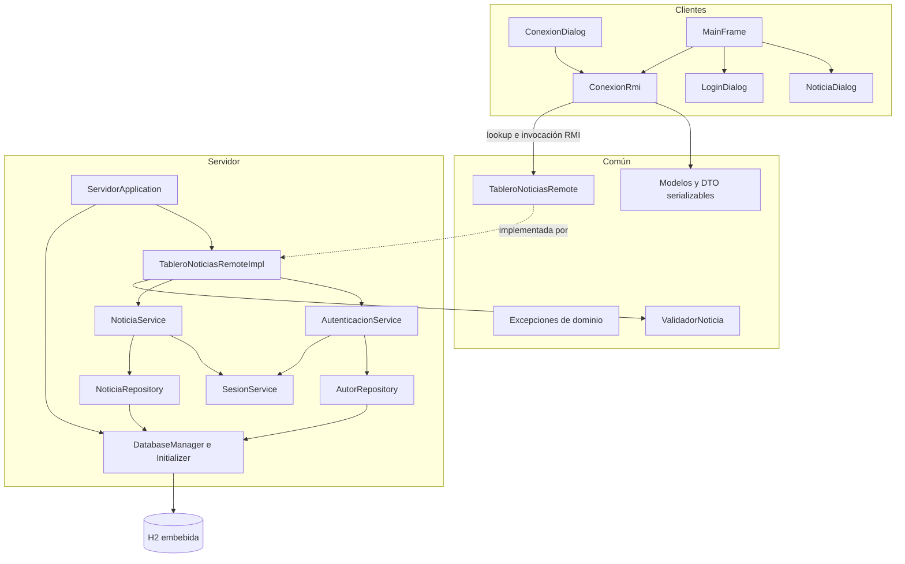

# Arquitectura

## Componentes

El sistema sigue una arquitectura cliente-servidor de tres módulos Maven. `common` define la frontera estable; `server` implementa negocio y persistencia; `client` ofrece la experiencia de lector y redactor.

## Flujo de comunicación

1. El usuario proporciona host, puerto del Registry y nombre del servicio.
2. `ConexionRmi` obtiene el Registry, ejecuta `lookup` y comprueba `verificarEstado()`.
3. La interfaz ejecuta la operación elegida en un `SwingWorker`.
4. RMI serializa DTO y argumentos definidos en `common`.
5. La implementación remota valida argumentos y delega en el servicio apropiado.
6. El servicio comprueba sesión y autorización cuando la operación escribe.
7. El repositorio obtiene una conexión JDBC propia y usa consultas preparadas.
8. El resultado se transforma a un `Noticia` inmutable y vuelve por valor al cliente.
9. `SwingWorker.done()` actualiza los componentes Swing en el EDT.

## Responsabilidades

### Cliente

- Recoger configuración de conexión y permitir reintentos.
- Presentar tabla, detalle, búsqueda y categorías.
- Gestionar el token recibido, sin persistirlo permanentemente.
- Ocultar o deshabilitar acciones no aplicables al rol o propietario.
- Dar retroalimentación inmediata de validación.
- Ejecutar toda comunicación fuera del EDT.
- Traducir fallos remotos y de dominio a mensajes comprensibles.

El cliente no decide autorización, no ejecuta SQL y no conserva una copia autoritativa de noticias.

### Servidor

- Configurar hostname y puertos RMI.
- Crear o localizar el Registry y registrar el servicio.
- Inicializar H2 y los datos académicos idempotentes.
- Autenticar con BCrypt y administrar sesiones con expiración.
- Validar, autorizar y ejecutar las operaciones de noticias.
- Delimitar transacciones y traducir errores internos.
- Registrar eventos relevantes y cerrar H2 al detenerse.

### Common

- Mantener firmas idénticas en ambos extremos.
- Proporcionar tipos serializables sin secretos ni referencias JDBC.
- Definir errores de negocio específicos.
- Compartir límites y normalización, sin sustituir la validación autoritativa del servidor.

## Límite remoto

El límite RMI está formado solo por `TableroNoticiasRemote`, sus argumentos, retornos y excepciones. Las entidades internas, conexiones y hashes permanecen en `server`. Los DTO son inmutables para impedir cambios accidentales después de construir la respuesta. Las fechas usan tipos estándar serializables y la versión acompaña cada noticia.

Una llamada remota no posee semántica de “exactamente una vez”. Si la conexión se pierde después de que el servidor confirma una transacción, el cliente puede desconocer el resultado. La interfaz no reintenta escrituras automáticamente; informa el fallo y deja que el usuario actualice antes de decidir.

## Configuración y red

Los valores predeterminados son Registry `1099`, objeto remoto `1100`, servicio `TableroNoticias`, base `./data/tablero-noticias` y sesión de 30 minutos. `rmi.host` debe ser una dirección que los demás equipos puedan resolver o alcanzar. Tener un puerto fijo para el objeto exportado evita que RMI seleccione uno efímero difícil de permitir en el firewall.

La configuración puede provenir de `server.properties`, variables de entorno o argumentos `--clave=valor`; los valores más específicos reemplazan los predeterminados. Esta flexibilidad no introduce un framework de configuración.

## Arranque y cierre

El arranque carga y valida configuración, establece `java.rmi.server.hostname`, abre H2, aplica esquema y semillas, crea o reutiliza el Registry, exporta el servicio y lo registra. Un shutdown hook retira o deja de exportar el objeto según corresponda y solicita el cierre limpio de H2. Un fallo de configuración o inicialización impide publicar un servicio incompleto.

## Dependencias permitidas

`common` depende solo de Java estándar en producción. `server` añade H2, BCrypt y SLF4J/Logback. `client` utiliza Java estándar y `common`. JUnit 5 queda con alcance de prueba. No existe dependencia hacia tecnologías web, ORM, inyección de dependencias ni una base externa.
