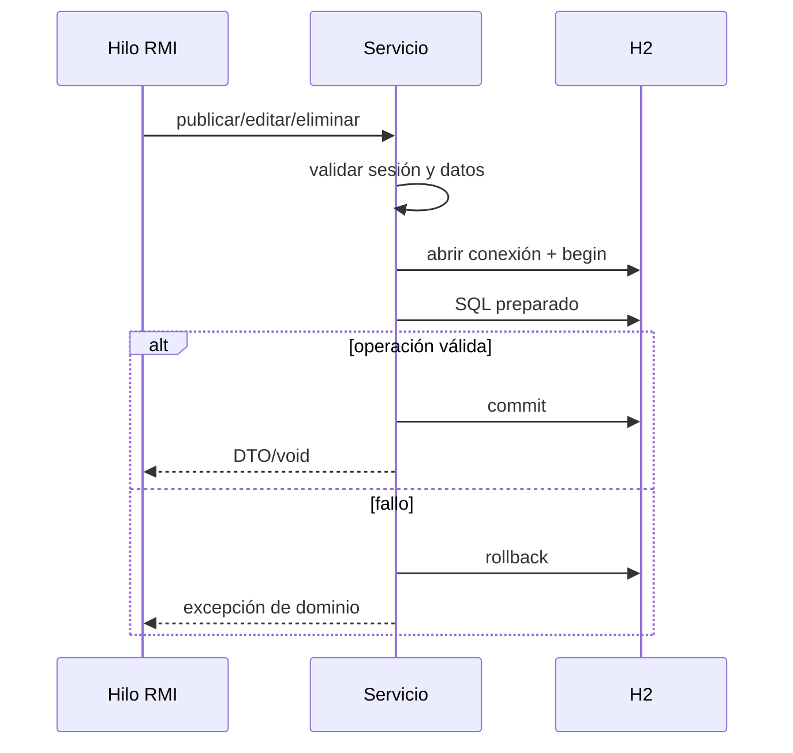
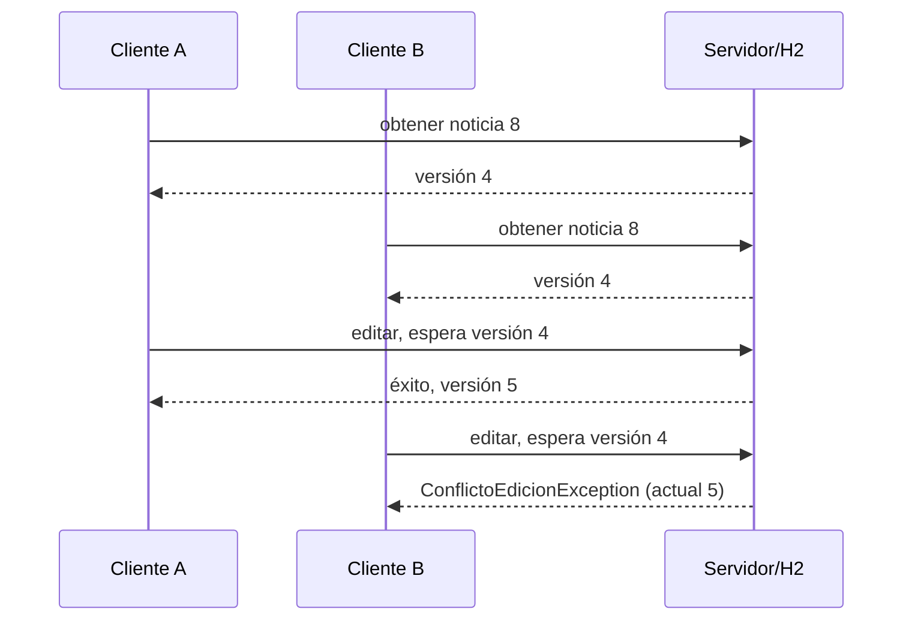

# Concurrencia y consistencia

## Modelo concurrente de RMI

Un objeto remoto puede recibir varias invocaciones al mismo tiempo. Aunque la interfaz parezca una colección de métodos Java ordinarios, no existe un hilo único implícito ni se garantiza el orden entre clientes. Por ello la implementación considera cada llamada como una unidad independiente y reentrante.

No se sincroniza todo `TableroNoticiasRemoteImpl`: un bloqueo global convertiría consultas independientes en una cola, reduciría capacidad y podría propagar la lentitud de una operación al resto. Los métodos remotos conservan únicamente referencias a servicios seguros; los datos variables de la solicitud viven en parámetros y variables locales.

## Estado compartido

Hay dos clases de estado:

- Las noticias y autores persisten en H2, que actúa como única fuente de verdad.
- Las sesiones son efímeras y viven en una estructura concurrente del proceso servidor.

No existe una caché permanente de noticias en el cliente ni un mapa duplicado en el servidor. Las ventanas conservan DTO solo para representar el último resultado y para conocer la versión abierta al editar.

Las sesiones se asocian a tokens aleatorios en un `ConcurrentHashMap`. Consultar una sesión verifica su expiración; una sesión vencida se rechaza y puede eliminarse atómicamente. Cerrar sesión es idempotente: retirar un token inexistente no afecta otras sesiones.

## Conexiones y transacciones

Cada operación solicita una conexión JDBC propia. No se comparten `Connection`, `PreparedStatement` o `ResultSet` entre hilos. Los recursos se cierran con `try-with-resources`.

Las lecturas ejecutan consultas preparadas independientes. Las escrituras desactivan `autoCommit`, ejecutan validación/autorización y SQL, confirman mediante `commit` y revierten mediante `rollback` si aparece una excepción. No se devuelve éxito antes del commit.

## Control optimista de edición

El control optimista evita mantener bloqueos mientras una persona lee y completa un diálogo. Al abrir una noticia, el cliente recibe su versión. Esa versión se envía como `versionEsperada`; el `UPDATE` solo afecta la fila si la versión almacenada todavía coincide.

Ejemplo con dos clientes:

El cliente B muestra: “La noticia fue modificada desde que se abrió. Actualice la información antes de volver a editarla”. La aplicación no fusiona ni sobrescribe datos automáticamente; B debe actualizar y evaluar de nuevo sus cambios.

## Distinción de cero filas actualizadas

Una actualización condicionada puede afectar cero filas porque:

1. El identificador no existe: `NoticiaNoEncontradaException`.
2. El identificador existe, pero el autor no coincide: `AutorizacionException`.
3. El propietario coincide, pero cambió la versión: `ConflictoEdicionException`.

Esta clasificación evita confundir un conflicto recuperable con un intento de acceso ilegítimo. La misma comprobación de propietario se aplica a eliminación, aunque esta no necesita versión en el contrato actual.

## Lecturas durante escrituras

H2 y las transacciones impiden observar una fila parcialmente escrita. Un lector verá el estado confirmado anterior o el posterior según el aislamiento y momento de su consulta, nunca una mezcla construida campo a campo. Una actualización manual posterior obtiene la fuente de verdad más reciente.

Los listados usan orden descendente por `fecha_modificacion` y un segundo criterio por `id`, lo que evita orden ambiguo si varias operaciones comparten una marca temporal. Cada noticia se construye completamente antes de incorporarla al resultado remoto.

## Publicaciones concurrentes

Los identificadores son generados por la identidad de H2. Cada publicación utiliza su propia transacción y recupera la clave generada de esa operación. No se calcula un identificador con “máximo + 1”, que produciría colisiones. Varias publicaciones válidas deben quedar almacenadas con IDs únicos.

## Riesgos evitados

- Actualización perdida: versión en el `WHERE`.
- Corrupción de JDBC: una conexión y statements por operación.
- Estado parcial: commit/rollback.
- Escalada de privilegios desde GUI: autorización repetida en servidor.
- Duplicación de datos: H2 como única fuente permanente.
- Carrera en sesiones: estructura concurrente.
- Serialización de mutaciones posteriores: DTO inmutables.
- Bloqueo general: ausencia de `synchronized` en toda la fachada remota.
- SQL injection: consultas preparadas.

## Pruebas concurrentes

Las pruebas usan `ExecutorService`, barreras o `CountDownLatch` y futuros:

- Múltiples lectores realizan listados y búsquedas simultáneos.
- Varias sesiones publican a la vez y se comprueban cantidad e IDs únicos.
- Dos editores parten de la misma versión; exactamente uno tiene éxito.
- Lectores consultan mientras otra tarea publica o edita y nunca reciben datos parciales.

Las barreras sincronizan el inicio relevante. Se evitan aserciones basadas en tiempos arbitrarios. El cierre del executor y de H2 forma parte de la limpieza de cada prueba.

## Alcance de la consistencia

La solución ofrece consistencia transaccional dentro de una única H2. No implementa consenso, replicación ni transacciones distribuidas porque solo existe un nodo de persistencia. Si se escalara a varias bases, sería necesario elegir una estrategia explícita de replicación, conflictos e idempotencia.
