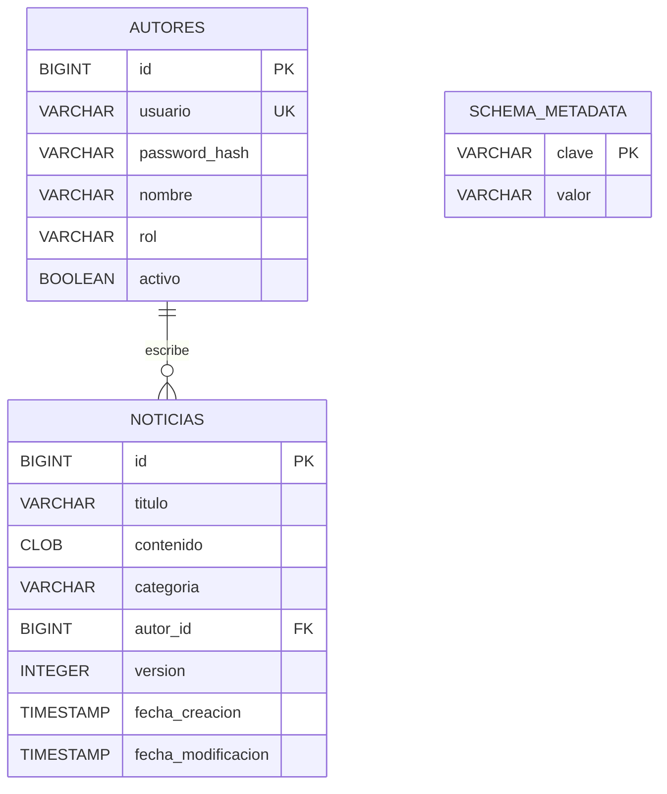

# Modelo de datos

## Diagrama



## Tabla `autores`

| Campo | Tipo | Restricciones | Propósito |
|---|---|---|---|
| `id` | `BIGINT` identidad | Clave primaria | Identificador estable del redactor. |
| `usuario` | `VARCHAR(50)` | `NOT NULL`, único | Nombre usado en autenticación. |
| `password_hash` | `VARCHAR(100)` | `NOT NULL` | Resultado BCrypt; nunca se incluye en DTO. |
| `nombre` | `VARCHAR(100)` | `NOT NULL` | Nombre visible en noticias y sesión. |
| `rol` | `VARCHAR(20)` | `NOT NULL` | Nombre persistido del enum, actualmente `REDACTOR`. |
| `activo` | `BOOLEAN` | `NOT NULL`, predeterminado `TRUE` | Permite impedir nuevos inicios de sesión. |

La contraseña en texto plano solo existe durante la comparación de autenticación y se descarta. `AutorEntity` es un tipo interno del servidor; `common.model.Autor` no contiene hash.

La administracion de redactores no se expone en la interfaz Swing. Para listar, crear, activar o desactivar usuarios desde la maquina del servidor, consultar [ADMINISTRACION_USUARIOS.md](ADMINISTRACION_USUARIOS.md). Ese documento tambien explica como abrir H2 Console para inspeccionar los datos en el navegador.

## Tabla `noticias`

| Campo | Tipo | Restricciones | Propósito |
|---|---|---|---|
| `id` | `BIGINT` identidad | Clave primaria | Identificador de noticia. |
| `titulo` | `VARCHAR(200)` | `NOT NULL` | Título ya normalizado. |
| `contenido` | `CLOB` | `NOT NULL` | Texto completo, con máximo aplicado por Java. |
| `categoria` | `VARCHAR(50)` | `NOT NULL` | `Categoria.name()`, independiente de la etiqueta Swing. |
| `autor_id` | `BIGINT` | `NOT NULL`, FK a `autores(id)` | Propietario utilizado en autorización. |
| `version` | `INTEGER` | `NOT NULL`, predeterminado 1, `CHECK >= 1` | Control optimista. |
| `fecha_creacion` | `TIMESTAMP` | `NOT NULL` | Momento de inserción. |
| `fecha_modificacion` | `TIMESTAMP` | `NOT NULL` | Última publicación o edición. |

No se aplica eliminación en cascada. La práctica no expone administración de autores y una noticia siempre debe conservar un autor válido.

## Tabla `schema_metadata`

Esta tabla de pares `clave`/`valor` registra hitos internos de inicialización. La clave `seed.demo.v1` evita duplicar las tres noticias de ejemplo en cada arranque. Los usuarios también se insertan solo si su nombre no existe. Todo el proceso de esquema y semillas ocurre en una transacción.

## Relaciones y restricciones

- `noticias.autor_id` referencia a `autores.id`.
- `autores.usuario` es único.
- Los campos de negocio esenciales son obligatorios.
- `noticias.version` nunca puede ser menor que uno.
- Los identificadores se generan en H2; el cliente no los propone.
- La categoría y rol se convierten con `Enum.name()` y `Enum.valueOf()`.

Las restricciones SQL son una segunda barrera. No reemplazan la validación de longitud, blancos, sesión o propietario ejecutada antes de modificar la base.

## Índices

| Índice | Columnas | Uso |
|---|---|---|
| `idx_noticias_categoria` | `categoria` | Filtro de categoría. |
| `idx_noticias_autor` | `autor_id` | Comprobación de propietario y consultas internas. |
| `idx_noticias_modificacion` | `fecha_modificacion DESC` | Listados recientes. |

El índice único de usuario es consecuencia de su restricción `UNIQUE`. La búsqueda académica por palabra utiliza comparación insensible a mayúsculas en título y contenido; para un volumen real se evaluaría un índice de texto completo.

## Control de versión

Una noticia comienza con versión 1. La edición se realiza conceptualmente así:

```sql
UPDATE noticias
SET titulo = ?,
    contenido = ?,
    categoria = ?,
    version = version + 1,
    fecha_modificacion = CURRENT_TIMESTAMP
WHERE id = ?
  AND autor_id = ?
  AND version = ?;
```

Si el contador de filas es cero, el servicio distingue tres casos mediante consultas preparadas: la noticia no existe, pertenece a otro autor o su versión ya cambió. El último produce `ConflictoEdicionException`; no se intenta una sobrescritura automática.

## DTO resultante

El repositorio une noticia y autor para construir `common.model.Noticia` con `autorId` y `autorNombre`. Este DTO contiene todos los campos visibles, pero no referencias a JDBC, contraseña ni estado interno de sesión. Las fechas y la versión recibidas provienen de la base, que es la fuente de verdad.

## Base de pruebas

Las pruebas crean instancias H2 en memoria mediante un nombre independiente. `DB_CLOSE_DELAY=-1` mantiene la base durante el caso de prueba y el cierre explícito ejecuta `SHUTDOWN`. Ninguna prueba debe abrir la ruta persistente configurada para el servidor normal.
